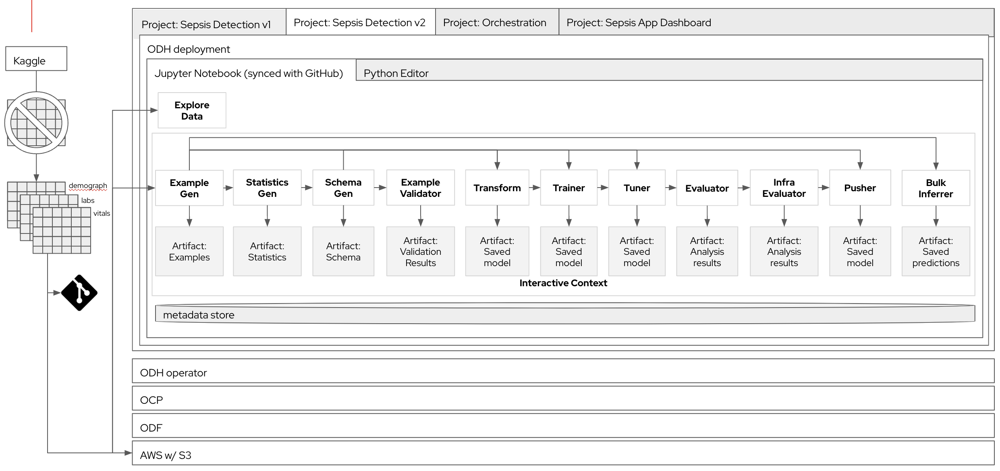

# Machine Learning Operations Prototype

Goal: Demonstrate MLOps Lifecycle automation using the scenario of predicting patient at-risk of sepsis based on patient data

## Tooling

* [OpenShift 4.8](https://www.redhat.com/en/technologies/cloud-computing/openshift)
* [Amazon S3](https://aws.amazon.com/s3/)(Optional)
* [S2I](https://github.com/openshift/source-to-image)
* [Apache Airflow](https://airflow.apache.org/)
* [Open Data Hub](https://opendatahub.io/)

