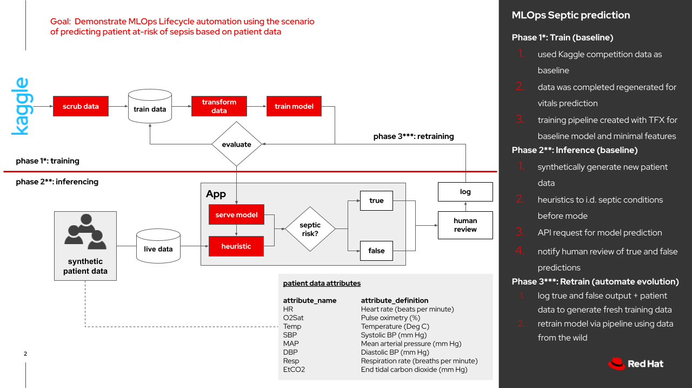

# Machine Learning Operations Prototype

Goal: Goal:  Demonstrate MLOps Lifecycle automation using the scenario of predicting patient at-risk of sepsis based on patient data

“MLOps is a practice for collaboration and communication between data scientists and operations professionals to help manage production ML lifecycle.”

“Similar to the DevOps or DataOps approaches, MLOps looks to increase automation and improve the quality of production ML while also focusing on business and regulatory requirements.”



**Phase 1: Train (baseline)**
1. used Kaggle competition data as baseline
2. data was completed regenerated for vitals prediction
3. training pipeline created with TFX for baseline model and minimal features

**Phase 2: Inference (baseline)**
4. synthetically generate new patient data
5. heuristics to i.d. septic conditions before model
6. API request for model prediction
7. notify human review of true and false predictions

**Phase 3: Retrain (automate evolution)**
8. log true and false output + patient data to generate fresh training data
9. retrain model via pipeline using data from the wild


```
# install ODH on OpenShift using the kfdef below
docs/opendatahub-kfdef

# git clone the project
git clone https://github.com/redhat-na-ssa/mlops-prototype.git

## launch terminal and run setup script from the directory the setup.sh script
./setup.sh

# start at the notebooks/vitals-septic-prediction-pipeline.ipynb
Launch vitals-septic-prediction-pipeline.ipynb

## launch terminal and run cleanup script from the directory the cleanup.sh script
# ./cleanup.sh

## Airflow configuration in Airflow subdir

## ODH Uninstallation
# Option: delete ALL resources labeled with "opendatahub" clusterwide
oc delete all --selector opendatahub.io/component=true --all-namespaces
oc delete operatorgroup -n openshift-operators opendatahub

# Option: delete ONLY the project
oc delete project <project-name>

# Option: delete ONLY the kfdef in the project requires the file path
oc delete -f <path>/kfdef
```


Resources
- https://www.iteblog.com/ppt/dataai-summit-europe-2020/streaming-inference-with-apache-beam-and-tfx-iteblog.com.pdf
